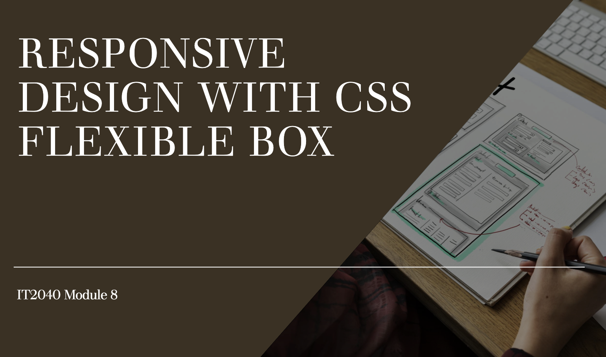
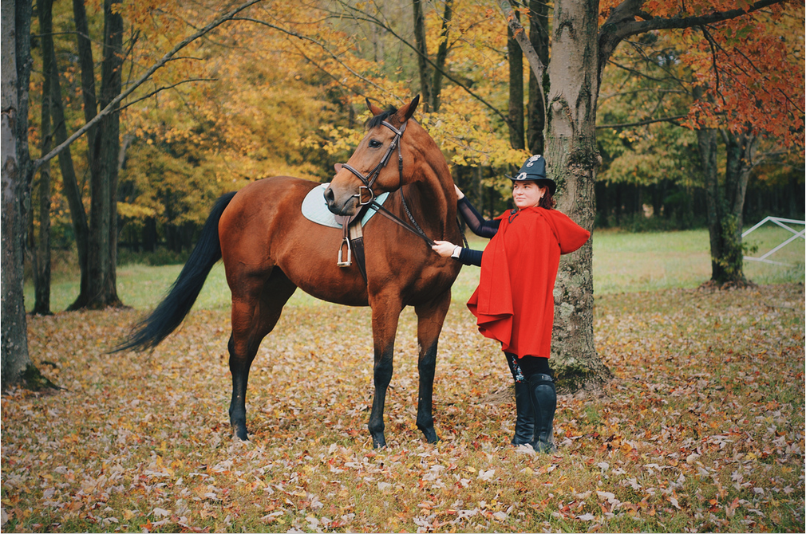
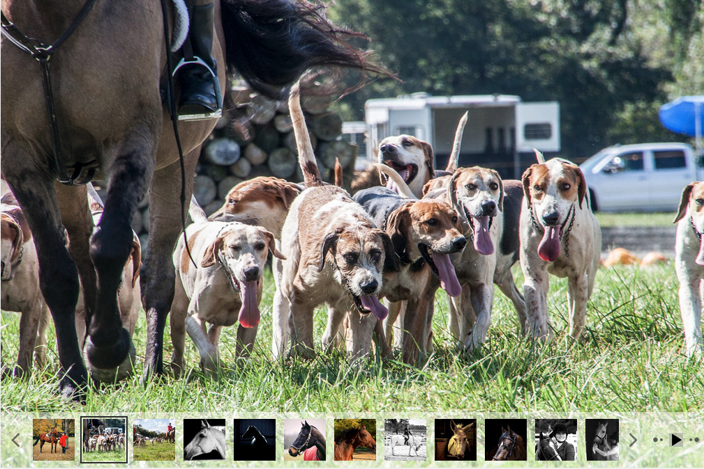
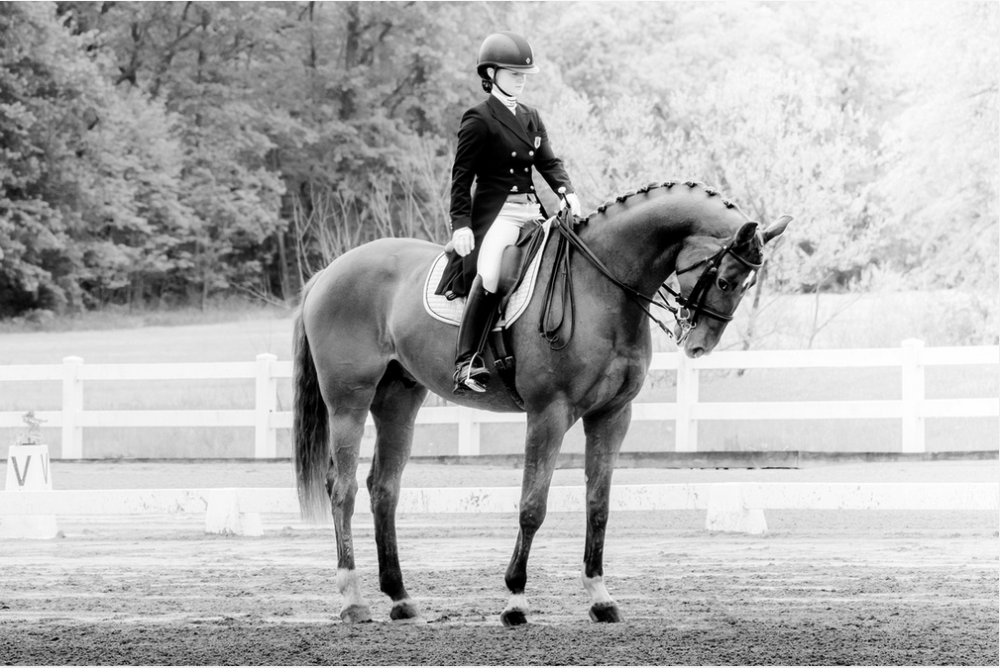
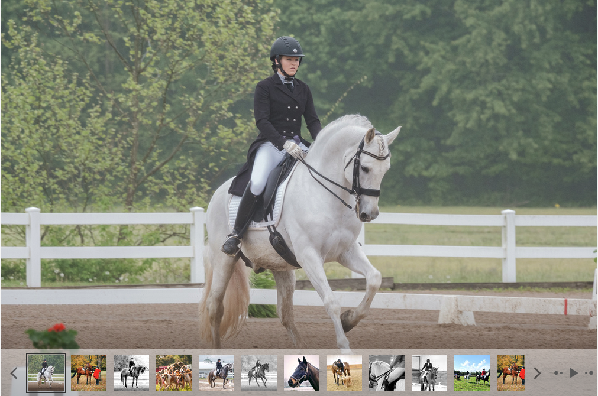

<!DOCTYPE HTML>
<html lang=en>
<head>
<meta charset="UTF-8">
<link rel="stylesheet" href="stylesheet.css">
	<title> Flexbox Layout Lab</title>

</head>
<body> 
<header> 
<nav> 

</nav>
</header>
<main>

	<article>
	<h1> Article title Goes Here</h1>
		

Lorem ipsum dolor sit amet consectetur adipiscing elit.
 Leo eu aenean sed diam urna tempor pulvinar. Semper vel class aptent taciti sociosqu ad litora.
 Mus donec rhoncus eros lobortis nulla molestie mattis. Blandit quis suspendisse aliquet nisi sodales consequat magna.
 Ac tincidunt nam porta elementum a enim euismod. Cras eleifend turpis fames primis vulputate ornare sagittis.
 Netus suscipit auctor curabitur facilisi cubilia curae hac. Sem placerat in id cursus mi pretium tellus.
 Egestas iaculis massa nisl malesuada lacinia integer nunc. Orci varius natoque penatibus et magnis dis parturient.
 Non purus est efficitur laoreet mauris pharetra vestibulum. Finibus facilisis dapibus etiam interdum tortor ligula congue.
 Dignissim velit aliquam imperdiet mollis nullam volutpat porttitor.
 Proin libero feugiat tristique accumsan maecenas potenti ultricies.
 Sit amet consectetur adipiscing elit quisque faucibus ex.
 Sed diam urna tempor pulvinar vivamus fringilla lacus.

 Aptent taciti sociosqu ad litora torquent per conubia.

</article>

<section id="galGrid">
<h2>Sample Image Gallery</h2>

</section>
<aside>
<h2> A little Aside Title</h2>
<ol> 
	<li>Filler item 1</li>
	<li>Filler item 2</li>
	<li>Filler item 3</li>
	<li>Filler item 4</li>
</ol>
</aside>

</main>
<footer>
	
 Small footer text. More Lorem Ipsum here. 

	</footer>
	</body>
